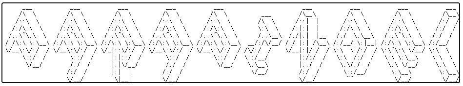

# ParaPindel
This is a multi-processes parallel version of Pindel to accelerate structural variation detection. Pindel's implementation can be found at https://github.com/xjtu-omics/pindel


## Publication
Yang, Y., Wang, X., Xu, Y., Yang, C., Jiang, B., & Peng, S. (2021, December). ParaPindel: a scalable coordinated parallel detection framework for human genome-wide structural variation. In 2021 IEEE International Conference on Bioinformatics and Biomedicine (BIBM) (pp. 574-579). IEEE.

## To run ParaPindel, follow these steps:

### 1. Configure MPI environment
I recommend [MPICH](https://www.mpich.org/) or [intelMPI](https://software.intel.com/content/www/us/en/develop/documentation/mpi-developer-guide-linux/top/installation-and-prerequisites/installation.html)

### 2. Download ParaPindel
```
git clone https://github.com/pengsl-lab/ParaPindel.git
```

### 3. Compile ParaPindel using the commands
```
cd ParaPindel
./INSTALL ./htslib
```
#### If you have installed the HTSLIB library, use the following command:
```
./INSTALL /home/user/path/to/your/htslib
```

### Run ParaPindel
#### (1) Create a new directory to store the results
```
mkdir result
```
#### (2) Create a configuration file ```test.config``` for locating the bam file, including the location of the bam file (it is best to use an absolute path), InsertSize and a field named for the bam file. For example:
````
/home/user/path/to/yuor/test.bam 500 test
````
#### (3) If it is on a workstation with a single node, use the following command to run ParaPindel
```
mpirun -np 4 ./paraPindel -f /path/to/your/reference.fasta -i /path/to/your/test.config -w 5 -W 5 -c ALL -T 8 -o ./result/test
```
The ```-np``` parameter represents the number of processes. Other parameters can be viewed using the ```./paraPindel -h``` command.
#### (4) If it is on a multi-node cluster with slurm, use the following command（The specific submission instructions depend on the cluster you are using）:
```
srun -N 4 ./paraPindel -f /path/to/your/reference.fasta -i /path/to/your/test.config -w 5 -W 5 -c ALL -T 8 -o ./result/test
```
Or submit according to the job method with the following command:
```
sbatch -N 4 ./paraPindel -f /path/to/your/reference.fasta -i /path/to/your/test.config -w 5 -W 5 -c ALL -T 8 -o ./result/test
```

```-np``` is a parameter that needs to be added when running the ```mpirun``` command, not a parameter of ```./paraPindel```, which represents how many processes are used for parallel detection. Similarly, ```-N``` is the parameter when running the ```srun``` or ```sbatch``` command.
<br>The ```-T``` parameter is implemented in the current Pindel version (https://github.com/xjtu-omics/pindel) and represents the number of threads. ```-T 8``` is specified here, which means that 8 threads are used in each process. <br>
### Combine the calculation results of each process, take deletion variation as an example.
```
cd ./result
cat test_D_* > test_D
rm test_D_*
```
### Convert the result into ```vcf``` format if the reference is hg19.
```
../pindel2vcf -p test_D -r /path/to/your/reference.fasta -R hg19 -d 20210606 -G -v test_D.vcf
cat test_D.vcf | vcf-sort > test_D_sorted.vcf
```
The ```pindel2vcf``` tool is used to convert the variation results into ```vcf``` format, which is implemented in Pindel. For the specific usage of ```pindel2vcf```, please refer to the Pindel homepage (https://github.com/xjtu-omics/pindel).

### If you have any questions or comments, please feel free to email:yangyn@hnu.edu.cn
